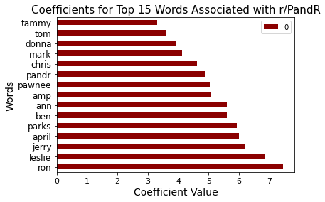
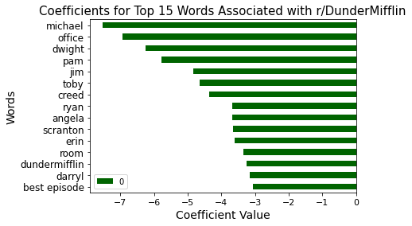

# Subreddit Classification Using Web APIs & NLP
#### Danielle Medellin [GitHub](https://github.com/dmedellin2)

## Problem Statement
NBC is looking to see how people engage with some of their most famous sitcoms on social media. An intern at NBC was tasked with gathering as many posts as he could for NBC sitcoms like _Will & Grace, The Office, Parks and Recreation, Brooklyn 99_, and _The Good Place_. Unfortunately, this intern was terrible at organization and dumped all of the posts he found into one general folder. NBC needs to identify which show these posts belong to and have asked for our help, specifically with their difficulty classifying two shows: _The Office_ and _Parks and Recreation_.

It is so difficult to separate the posts between these two shows because they share a lot of similarities. For starters, they share some of the same creators including Greg Daniels and Michael Schur. Both shows are considered workplace comedies as they take place at either a paper company or a government office. While both shows started and ended in different years, they had many years of overlap where both were actively on the air. Additionally, the two shows share some character names and even an actor! For example, both shows include a character named 'Andy' and Rashida Jones played a consistent role in both TV shows. Looking at crossover between character names and actor names, we get even more commonalities, for example the character 'Michael Scott' from _The Office_ and the actor Adam Scott, who plays a main role in _Parks and Recreation_.  

Due to the many similarities between these two shows, NBC came to us to help them sort through the posts they gathered. We will use the related subreddits for each of these shows to help us build a model that can classify the posts correctly. The two subreddits we will use are: **r/DunderMifflin** -- _The Office_, and **r/PandR** -- _Parks and Recreation_ .  

Additionally, NBC is also interested in what content helped made it possible to differentiate between the two shows and what Reddit users are talking about the most in each of the subreddits. 

We will build a classification model that will help to sort each post to its appropriate subreddit. Our model's success will be measured with an accuracy score.

## Executive Summary
Our goal was to build a model that could classify reddit submissions into their appropriate subreddits, which were based on two TV shows that share a lot of similarities. We wanted to find the best indicators that could help predict which subreddit a submission would fall into. 

We collected our data using the [Pushshift Reddit API](https://github.com/pushshift/api). The work for this can be found in the `data_gathering` notebook. We collected submissions from both subreddits in 6 month intervals over the past 10 years. Both shows have been off the air for quite some time so we had to dig a little deeper to find posts that were submitted when the shows were still on. _The Office_ aired from 2005-2013 and _Parks and Recreation_ aired from 2009-2015. Both subreddits were first created in January 2011. 

The data we collected included the submissions to the individual subreddits and information about those submissions including: titles, number of comments, authors, and scores. A full data dictionary can be found below. 

### Data Dictionary
|Feature|Type|Description|
|:---|:---:|:---|
|title|object|The title of the Reddit submission|
|selftext|object|Additional text about the post (optional)|
|subreddit|int|A 0 indicates r/DunderMiffilin, a 1 indicates r/PandR|
|author|object|Username of submission author|
|num_comments|int|Number of comments on that submission|
|score|int|A submission's score is the number of upvotes minus the number of downvotes|
|timestamp|datetime|The date of submission|

Once we had our data, we did some data cleaning and began to look at the possible features that could help predict which subreddit a post was from. Each submission has a title and we beleived that looking at the contents of these titles would be a good indicator of subreddit page. Many of the submissions had additional text(self text), but not all submissions did. This could have added information to our model, but was determined to not be a useful feature because we were missing a good portion of that data, and for many of the posts on these subreddits, there was very little additional text. Most posts included images or videos. We explored other features such as number of comments on a post and a submission score, but ultimately found that there was not enough difference in these features for each of the subreddits to help our predictions. 

Our main feature to load into our model would be the titles of the submissions. In order to be useful, we had to turn this data into numeric data and did so using a Count Vectorizer or TF-IDF Vectorizer, which looked at the frequencies of the words in each title. We explored the most frequently seen words and created a list of stop words that we felt were not useful in identifying an individual subreddit and thus would not include them in the modeling process. This was an iterative process, as the two shows shared a lot, and thus there was a lot of overlap in the top most used words in submission titles. 

We then explored many different classification models, taking time to tune each one in an effort to get a high accuracy score, and a model that was not too overfit. We evaluated our models and from them made conclusions and recommendations for NBC and how they could move forward with their sorting problem. 
### Most Influential Words

  

Above we can see the top 15 indicator words for both subreddits found by our Logistic Regression model. 

## Conclusions & Recommendations
Ultimately, we chose our Multinomial Naive Bayes model as our best predictive model and the Logistic Regression model for our best interpretable model. While our models did not perform _exceptionally well_, they were able to accurately classify almost 80% of the data. All of the models we tested performed much better than the baseline model. We found that words that reference characters and places from the TV shows were the best indicators for which subreddit a submission belongs in. Despite having some very strong indicators, there were still many misclassified posts. Because the shows are so similar, they have an overlapping fan base that often compare, discuss, and mention the two shows in both subreddits. 

An interesting finding was that both of our chosen models classified posts from the r/DunderMifflin subreddit at a better rate than the r/PandR subreddit. For future models, we would look more into this fact and try to find stronger indicators for the r/PandR subreddit as well as continue to narrow down the words that can cause misclassification. 

Finally, NBC could use this model to help classify posts from other social media platforms, not just Reddit, to classify them as relating to _The Office_ or _Parks and Recreation_. 

## References
“The Office.” IMDb, IMDb.com, 24 Mar. 2005, www.imdb.com/title/tt0386676/.  

“Parks and Recreation.” IMDb, IMDb.com, 9 Apr. 2009, www.imdb.com/title/tt1266020/.  

Pushshift.io. “Pushshift Reddit API Documentation.” GitHub, 1 Oct. 2019, github.com/pushshift/api.  

“r/DunderMifflin: People Person's Paper People.” Reddit, www.reddit.com/r/DunderMifflin/.  

“r/PandR: Tommy's Place.” Reddit, www.reddit.com/r/PandR/.   

“r/Reddit.com.” Reddit, www.reddit.com/wiki/faq#wiki_how_is_a_submission.27s_score_determined.3F.